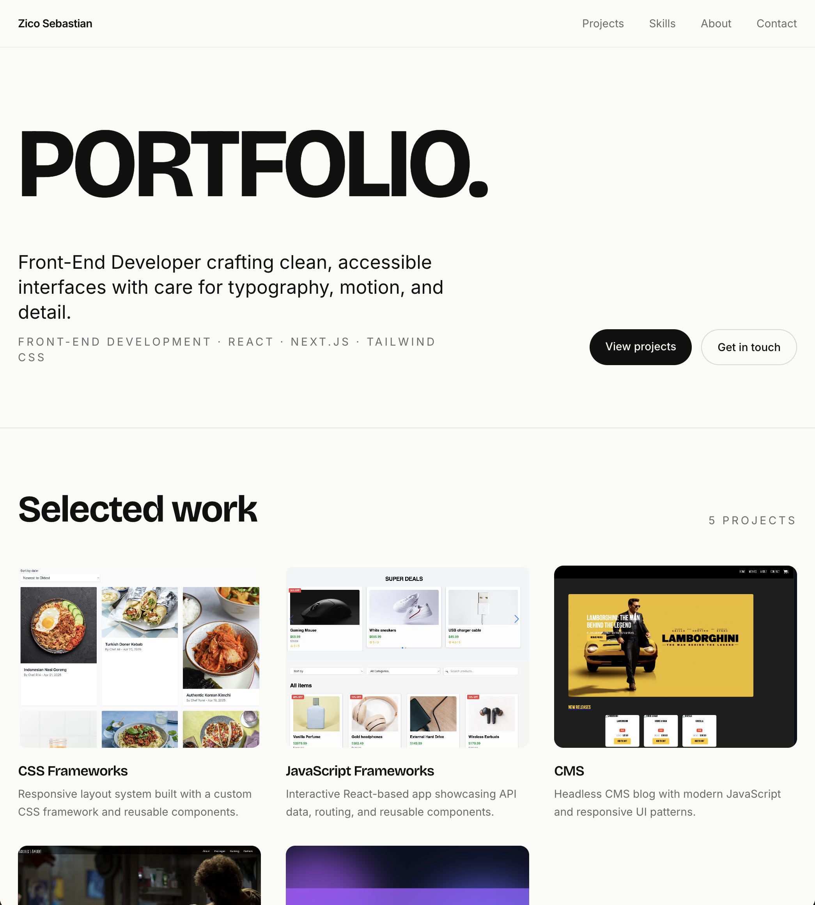

# Portfolio II – Zico Sebastian



A personal Front-End Developer portfolio built for the Noroff Front-End Development course. It showcases my selected projects, skills, and contact information.

## Description

This is the second portfolio assignment (Portfolio 2) for the Noroff Front-End Development program. The site presents who I am, the projects I've built, and how to get in touch.

The site includes the following sections:

- Hero with my name and a short intro
- Selected work (project cards)
- By the Numbers (KPI section)
- Featured highlight (parallax band)
- Skills
- About me
- Contact form
- Footer

### Resit Updates (POR2-features-resit branch)

For the Course Assignment Resit 1, this branch adds the following features on top of the original portfolio:

- **KPI section** — placed directly below the project cards on the home page. Shows three numbers: Projects Completed, Years of Experience, and Clients.
- **Parallax effect** — a full-width section below the KPI block that uses `background-attachment: fixed` (Tailwind's `bg-fixed`) so the background image stays in place while the page scrolls.

The visual design was also refreshed for the resit — light cream background, Bricolage Grotesque display font, and a warm coral accent colour.

## Built With

- [React](https://react.dev/)
- [Vite](https://vitejs.dev/)
- [Tailwind CSS](https://tailwindcss.com/)
- [React Router](https://reactrouter.com/)
- [Framer Motion](https://www.framer.com/motion/)

## Getting Started

### Installing

1. Clone the repo:

```
git clone https://github.com/ziconstr/portfolio2main.git
```

2. Move into the project folder:

```
cd portfolio2main
```

3. Install the dependencies:

```
npm install
```

### Running

To start the development server, run:

```
npm run dev
```

The site will be available at `http://localhost:5173/`.

To build the site for production:

```
npm run build
```

To preview the production build:

```
npm run preview
```

## Contributing

This is a school project, but if you'd like to suggest improvements you can fork the repo and open a pull request.

## Contact

- GitHub: [ziconstr](https://github.com/ziconstr)
- Live site: [portfolio2resit.netlify.app](https://portfolio2resit.netlify.app/)

## Acknowledgments

- Noroff Front-End Development course materials
- AI assistance for brainstorming and explanations (see `AI_LOG.md` for full details)
